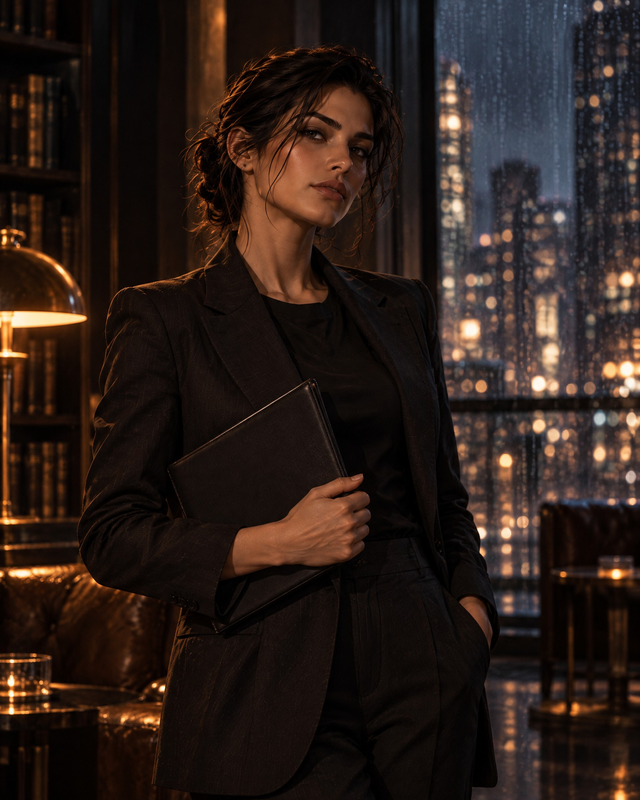

# House Figure — Identity Sheet

**Status:** Concept-development control. The working name, final persona, and public deployment are owner decisions. This record does not authorize public use.

## Definition

The House Figure is a **fictional recurring visual narrator**. She gives certain SAVRONO art, transitions, covers, and social concepts a recognizable human presence. She is not an employee, journalist, named contributor, source, expert, or endorser.

## Canonical visual anchors

- composed adult figure; dark wavy updo; tailored dark suiting; warm/cold cinematic light;
- poised, observant, editorial presence; a folio or book may appear without readable content;
- environments may include an editorial library, lounge, studio, rainy city, atelier, or Technology Lounge threshold;
- use restraint rather than a mascot costume, fantasy character treatment, influencer pose, or celebrity mimicry.

## Candidate uses and boundaries

| Candidate use | Allowed only when | Prohibited implication |
| --- | --- | --- |
| Cover and issue promotion | Material is marked generated/illustrated where a reasonable reader could mistake it for reportage. | A real cover subject, journalist, or source. |
| Opinion / culture / food / fashion-design art | The actual author and evidence retain visual and textual primacy. | The House Figure authored, witnessed, or verified the work. |
| Tech Lounge atmosphere | She functions as a visual observer. | Technical authority, red-team analyst, security source, or incident actor. |
| Ads, memes, and transitions | Campaign scope and disclosure are approved separately. | Product, medical, financial, political, or institutional endorsement. |

## Mandatory pre-publication gate

Before first public use, the package owner must create a versioned record stating:

1. working name and short persona;
2. source ownership or model-release confirmation for the reference material;
3. canonical visual references and allowed variation range;
4. disclosure language for generated/illustrated uses;
5. exact allowed placements and prohibited portrayals;
6. derivative provenance record for each production image;
7. reviewer for rights/disclosure and final owner approval.

## Prohibited portrayals

- invented news event, documentary photograph, witness testimony, or real-world evidence;
- fake staff account, author bio, byline, credential, or source attribution;
- political persuasion in her voice without a separate owner decision;
- sexualized treatment, minors, protected-trait stereotyping, or implication of consent/endorsement absent evidence;
- medical, financial, legal, safety, or product claims delivered through the figure.
