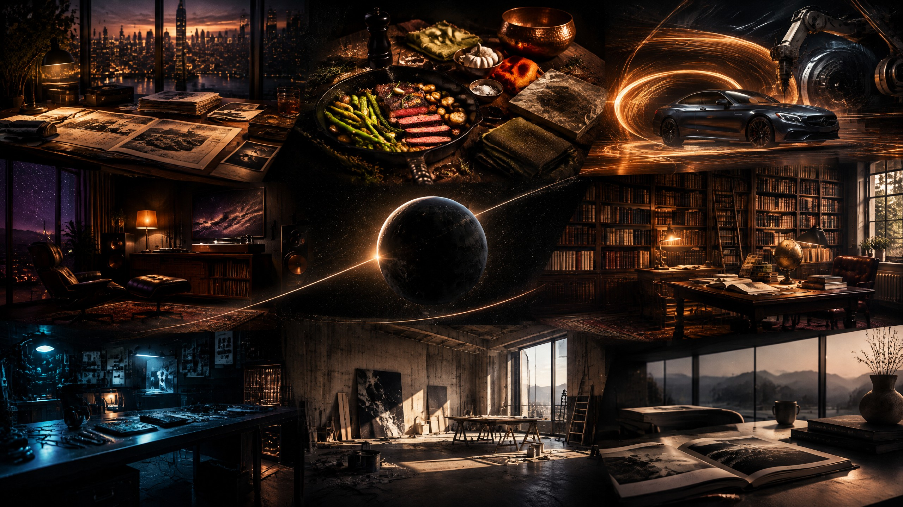
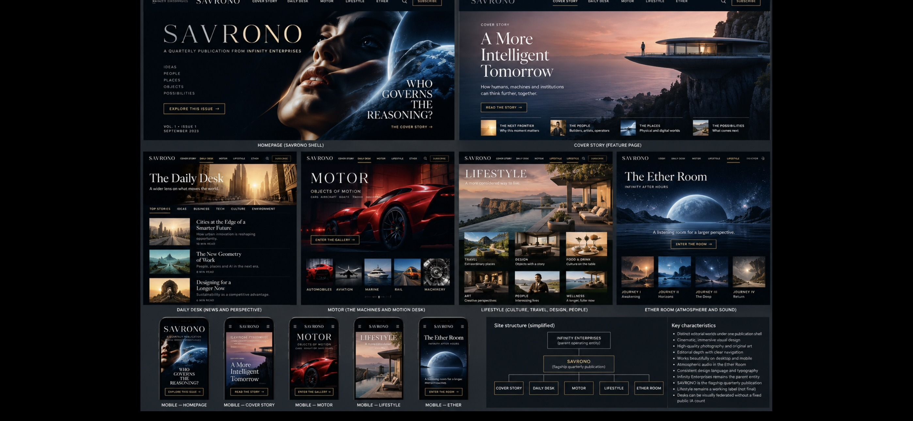

# SAVRONO Visual Direction Review Packet — 2026-10-02

> **Design-only review evidence.** This package does not authorize a runtime redesign, a route or navigation change, source-asset replacement, deployment, or ChatGPT Sites publication.

This is the **single review package** for [#127](https://github.com/threshi-art/infinity-enterprises-site/issues/127). All current discussion about the material in this directory should happen on #127 and its linked PR, rather than scattering decisions across design artifacts.

## Authority and preservation

| Control | Record | What it controls |
| --- | --- | --- |
| Owner architecture | [#107](https://github.com/threshi-art/infinity-enterprises-site/issues/107), [#60](https://github.com/threshi-art/infinity-enterprises-site/issues/60) | Infinity Enterprises is the parent; SAVRONO is the flagship quarterly publication; current desk architecture. |
| Design families | [#76](https://github.com/threshi-art/infinity-enterprises-site/issues/76) | Static page-family and federated-principles guidance, not runtime implementation. |
| Art direction | [#109](https://github.com/threshi-art/infinity-enterprises-site/issues/109) | Federated desk journeys, source/rights boundary, and future Ready-card rule. |
| Current visual-vibe study | [#125](https://github.com/threshi-art/infinity-enterprises-site/issues/125), [PR #126](https://github.com/threshi-art/infinity-enterprises-site/pull/126) | Separate, narrow conceptual study. It is preserved and not modified by this package. |
| Current source baseline | `studio` at package branch cut | Existing routes, source art, MOTOR, Ether, FORM, and current desk identities remain preserved. |

## Reading order

1. [Visual Direction Catalogue](VISUAL-DIRECTION-CATALOGUE.md) establishes house constants and desk autonomy.
2. [Tech Lounge: Afterimage Workshop](TECH-LOUNGE-AFTERIMAGE-WORKSHOP.md) resolves the current Tech visual gap without discarding the live `/tech-lounge` baseline.
3. [House Figure Identity Sheet](HOUSE-FIGURE-IDENTITY-SHEET.md) defines the fictional recurring visual figure and its use controls.
4. [Asset Intake Register](ASSET-INTAKE-REGISTER.md) distinguishes generated studies, historical references, private candidates, and excluded source material.
5. [Traceability and Review Protocol](TRACEABILITY-AND-REVIEW-PROTOCOL.md) is the reusable Wiki ↔ issue ↔ PR control layer.
6. [Wiki Bridge Draft](WIKI-BRIDGE-DRAFT.md) records the exact post-merge Wiki updates proposed for a later, separate Wiki revision.

## Original conceptual studies

| Study | Intent | File |
| --- | --- | --- |
| Federated House Atlas | Tests one publishing house with genuinely distinct desk atmospheres. | [VD-01](studies/vd-01-federated-house-atlas.jpg) |
| Tech Lounge: Afterimage Workshop | Tests tactile after-hours technology, not generic SaaS or cyberpunk. | [VD-02](studies/vd-02-tech-lounge-afterimage-workshop.jpg) |
| House Figure: Editorial Arrival | Tests a fictional recurring visual narrator, not a contributor or source. | [VD-03](studies/vd-03-house-figure-editorial-arrival.jpg) |
| Lifestyle: Material Table | Tests cultural, non-instructional food/material atmosphere. | [VD-04](studies/vd-04-lifestyle-material-table.jpg) |
| MOTOR: Motion Study | Tests rail, aviation, industrial, and motorcycle motion without automotive-only framing. | [VD-05](studies/vd-05-motor-motion-study.jpg) |
| Daily Desk: Evidence Field | Tests inquiry and restraint without an invented real-world event. | [VD-06](studies/vd-06-daily-desk-evidence-field.jpg) |

## Historical/exploratory study

[The historical visual-study board](historical/principal-architect-savrano-visual-study-2026-10-02.jpg) is an owner-supplied internal study preserved as an **historical/exploratory reference only**.

> Its Ether Room placement, simplified structure, desk count, labels, navigation, sample content, and illustrative media are non-authoritative. Current architecture is controlled by #107 and #60. Do not derive a runtime map or implementation claim from this board.

## Non-goals

- No change to `src/`, Worker code, `build.mjs`, routes, navigation, public assets, or `site-source.json`.
- No inclusion of raw third-party screenshots, personal photograph candidates, or the owner-supplied RAW file.
- No claim that generated studies are reporting, source-cleared issue art, existing content, or production assets.
- No change to PR #126.
- No automatic runtime work. A future desk-specific Ready card must name exact source files, asset provenance, tests, visual evidence, reviewer, and target branch.
