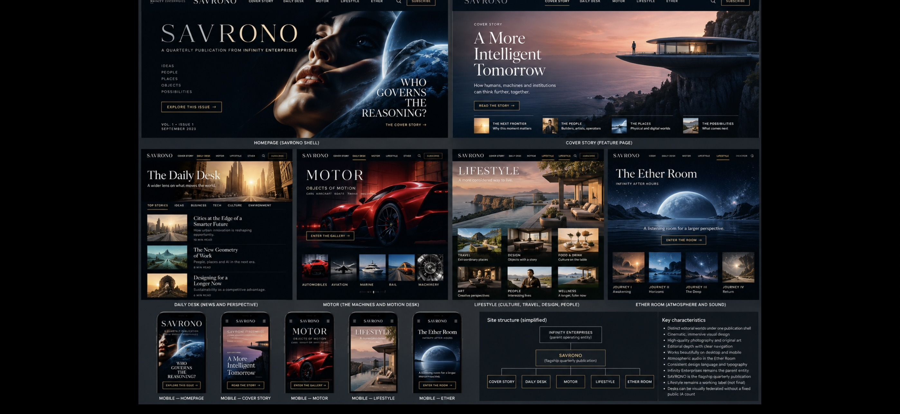

# Historical / Exploratory Reference

**Source:** Chris supplied this image and identified Seraphim as its creator.

> **Historical/exploratory visual study.** The labels, desk count, Ether Room placement, navigation, sample content, and structural diagram are illustrative and non-authoritative. See [#107](https://github.com/threshi-art/infinity-enterprises-site/issues/107) and [#60](https://github.com/threshi-art/infinity-enterprises-site/issues/60) for current architecture; see [#76](https://github.com/threshi-art/infinity-enterprises-site/issues/76) and [#109](https://github.com/threshi-art/infinity-enterprises-site/issues/109) for current design guidance.

## Why it is preserved

The board is an integrated early study of a home shell, Cover Story, Daily Desk, MOTOR, Lifestyle, Ether Room, mobile views, and a structural diagram. It is valuable comparative visual evidence for the evolution of federated desk journeys.

## What it cannot establish

- current public SAVRONO information architecture or desk count;
- public Ether Room placement;
- approved routes, masthead, navigation, staff, content, media, or feature availability;
- a runtime implementation instruction;
- replacement of current source art, route, or desk preservation baselines.
